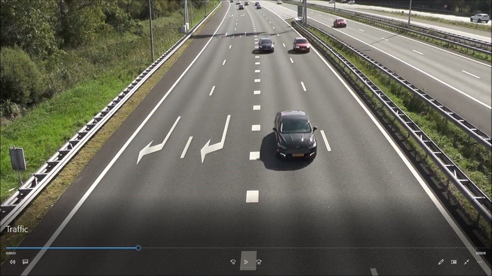
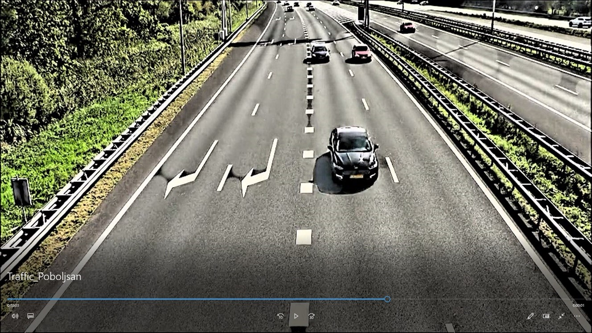
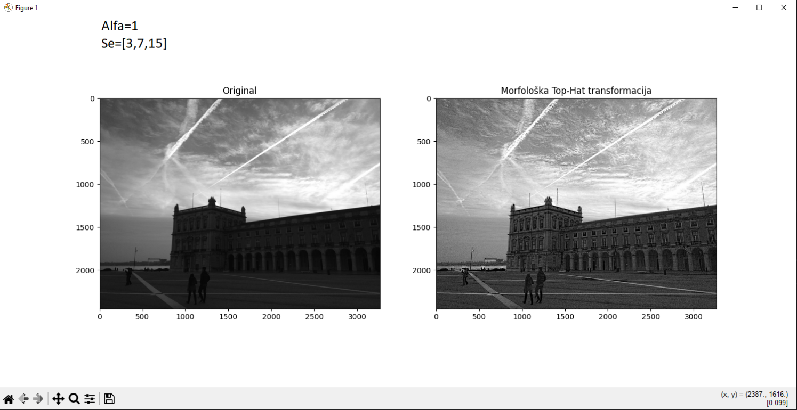
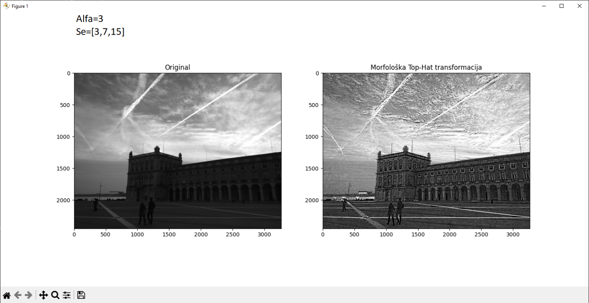
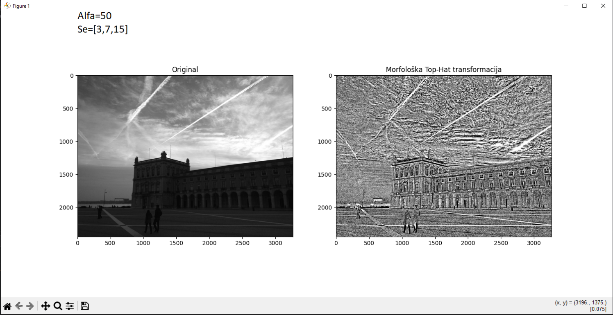
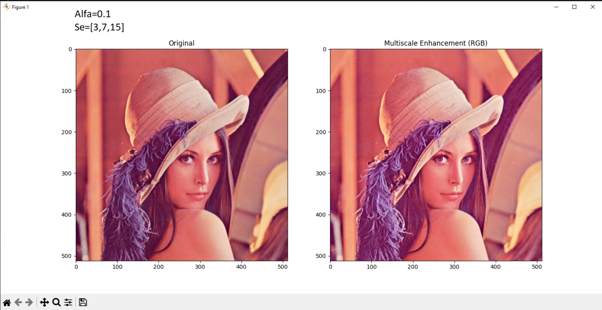
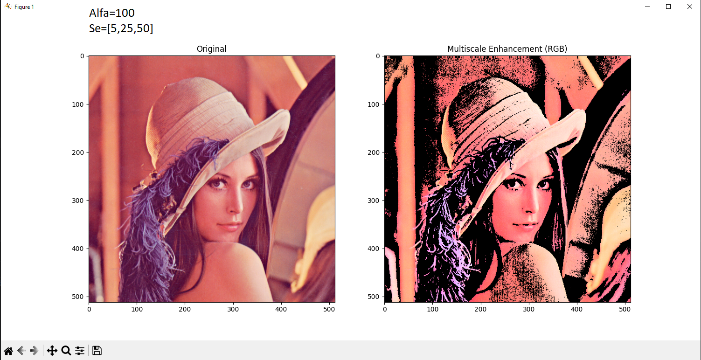

# Multiscale-Morphological-Image-Video-Enhancement
Advanced computer vision engine implementing multiscale morphological Top-Hat transformations for local contrast enhancement in grayscale images, RGB color spaces (via HSV), and real-time video streams
---

## 🚀 Key Features

1. **Grayscale Processing:**
   - Implements multiscale **White Top-Hat (WTH)** and **Black Top-Hat (BTH)** transformations using floating-point arithmetic (`float32`).
   - Aggregates structural element responses across multiple radii (e.g., $k \in \{3, 7, 15\}$) to isolate fine textures and edges without introducing noise[cite: 1].

2. **RGB Color Space Processing:**
   - Converts input frames from **RGB to HSV** color space.
   - Isolates and processes exclusively the **Value ($V$) channel** to enhance luminosity and contrast while preserving original chromaticity and hue information[cite: 1].

3. **Real-time Video Pipeline:**
   - Frame-by-frame sequential extraction using OpenCV.
   - Dynamic enhancement pipeline applied to video streams.
   - Re-encodes processed frames back into an 8-bit (`uint8`) `.avi` container while maintaining the original frame rate (FPS)[cite: 1].

---

## 📐 Mathematical Model

The core enhancement model relies on multiscale Top-Hat filtering combined with gamma correction:

$$f_{out} = f + \alpha \cdot \sum_{k} WTH_k(f) - \alpha \cdot \sum_{k} BTH_k(f)$$

- **White Top-Hat (WTH):** Isolates bright details smaller than the structural element ($WTH(f) = f - (f \circ b)$)[cite: 1].
- **Black Top-Hat (BTH):** Isolates dark details and crevices ($BTH(f) = (f \bullet b) - f$)[cite: 1].
- **Gamma Correction:** Applied as a final step ($f_{out}^{0.7}$) to non-linearly map intensities, bringing out shadow details without blowing out highlights[cite: 1].

---

## 🛠️ Tech Stack

- **Language:** Python
- **Libraries:** OpenCV (`cv2`), NumPy, Matplotlib

---

## 📂 Project Structure

```text
Multiscale-Morphological-Enhancement/
│
├── src/
│   └── enhancement_engine.py   # Core processing script for images & video
│
├── docs/
│   └── izvestaj.pdf            # Detailed project report (FTN)[cite: 1]
│
├── input/                      # Sample input media (e.g., traffic video)
│
├── output/                     # Processed output results
│
├── requirements.txt            # Project dependencies
└── README.md


## 📊 Results & Visualizations

### 1. Real-time Video Enhancement (Traffic Sequence)
Comparison between the original video frame and the enhanced version using multiscale morphological top-hat filtering and HSV color space processing[cite: 1]:

<table>
  <tr>
    <td align="center"><b>Original Video Frame</b></td>
    <td align="center"><b>Enhanced Video Frame</b></td>
  </tr>
  <tr>
    <td></td>
    <td></td>
  </tr>
</table>

---

### 2. Impact of Alpha ($\alpha$) Parameter Scaling
Visual effects of varying the $\alpha$ gain factor on grayscale and color images:

* **Grayscale Enhancement with different $\alpha$ values:**
  <p float="left">
    
    
    
  </p>

* **RGB Color Enhancement (Lena image):**
  <p float="left">
    
    
    
  </p>
